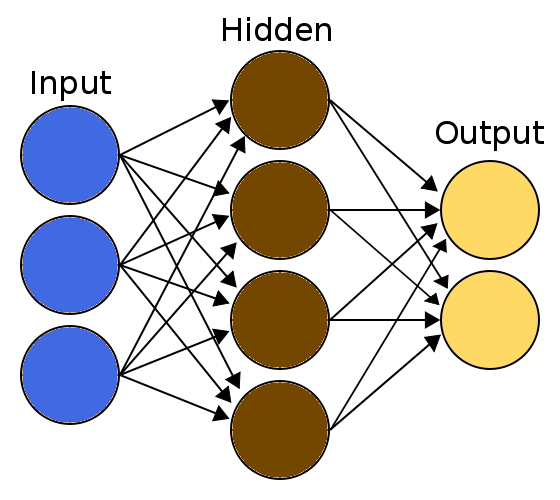

<!-- PROJECT LOGO -->
<br />
<p align="center">
  <a href="https://github.com/suyashsonawane/JavaNet">
    
  </a>

  <h3 align="center">JavaNet</h3>

  <p align="center">
    Understanding and Implementing Neural Networks in Java from Scratch 💻 Learning the popular concept in the most 💪strongly typed language
    <br />
    <a href="https://github.com/suyashsonawane/JavaNet"><strong>Explore the docs »</strong></a>
    <br />
    <br />
    <a href="https://github.com/suyashsonawane/JavaNet">View Demo</a>
    ·
    <a href="https://github.com/suyashsonawane/JavaNet/issues">Report Bug</a>
    ·
    <a href="https://github.com/suyashsonawane/JavaNet/issues">Request Feature</a>
  </p>
</p>

[![Contributors][contributors-shield]][contributors-url]
[![Forks][forks-shield]][forks-url]
[![Stargazers][stars-shield]][stars-url]
[![Issues][issues-shield]][issues-url]
[![MIT License][license-shield]][license-url]
[![LinkedIn][linkedin-shield]][linkedin-url]


<!-- ABOUT THE PROJECT -->
## About The Project

A simple ``Neural Network`` class completely written in Java from scratch without using any external libraries.

A Neural Network is a type of computational system which represents the human brain in a smaller manner. The ``Neurons`` are connected with ``Synapses``, these concepts were taken from the 🧠. The system simulates the learning process of the brain by adjusting the ``Weights`` of the synapses by the process of ``Backpropagation``.

Here's why you should consider using it:
* Easy to use and test
* Logging features  
* Customizable 

I also developed a even more feature rich ``JavaScript library`` which can be found here [Lite Neural Network](https://suyashsonawane.me/Lite-Neural-Networks/)


<!-- GETTING STARTED -->
## Getting Started
1.  Place `NeuralNetwork.java` in your project directory
2.  Instantiate the neuralnetwork object
3.  Process the data in proper format
4.  Train the model
5.  Test the model

_For full explanation, please refer to the [Article](https://towardsdatascience.com/understanding-and-implementing-neural-networks-in-java-from-scratch-61421bb6352c)_

<!-- USAGE EXAMPLES -->
## Usage

### Instantiating the neuralnetwork object
---

```java
// In the sample we are creating a neural network with 2 input features and 1 output with 10 hidden nodes

// default constructor
NeuralNetwork nn = new NeuralNetwork(2, 10, 1); 

// constructor with custom learning rate
NeuralNetwork nn_custom_lr = new NeuralNetwork(2, 10, 1, 0.01); 

// constructor with multi-threading set to true
NeuralNetwork nn_with_multithreading = new NeuralNetwork(2, 10, 1, true); 

// constructor with multi-threading set to true and custom learning rate
NeuralNetwork nn_custom_lr_with_multithreading = new NeuralNetwork(2, 10, 1, 0.01, true); 

```

### Data Format
---
```java
// As we have 2 input features we created the 2d double array for X and 1d double array for Y

double[][] X = { { 0, 0 }, { 1, 0 }, { 0, 1 }, { 1, 1 } };
double[][] Y = { { 0 }, { 1 }, { 1 }, { 0 } };

```
### Training the model
---
```java
// Here we pass the data and specify the number of epochs

nn.fit(X, Y, 500); // silent learn

nn.fit(X,Y,500,0); // logging set to 0, shows training time and average error

nn.fit(X,Y,500,1); // logging set to 1, shows logs for each epoch

```
### Testing the model
---
```java
// Here we used 4 data-points to test the model, we iterate and pass each data-point to the model

List<Double> output;
double[][] input = { { 0, 0 }, { 0, 1 }, { 1, 0 }, { 1, 1 } };
for (double d[] : input) {
    output = nn.predict(d);
    System.out.println(output.toString());
}

```


<!-- ROADMAP -->
## Roadmap

See the [open issues](https://github.com/suyashsonawane/JavaNet/issues) for a list of proposed features (and known issues).


<!-- CONTRIBUTING -->
## Contributing

Contributions are what make the open source community such an amazing place to be learn, inspire, and create. Any contributions you make are **greatly appreciated**.

1. Fork the Project
2. Create your Feature Branch (`git checkout -b feature/AmazingFeature`)
3. Commit your Changes (`git commit -m 'Add some AmazingFeature'`)
4. Push to the Branch (`git push origin feature/AmazingFeature`)
5. Open a Pull Request

## Project status

- [x] Basic Library
- [x] Documentation
- [x] Explanation Article
- [x] Multi-Threading Support
- [ ] Interface to load data easily
- [ ] Multiple layer architecture
- [ ] Improve performance
- [ ] Unit Testing
- [ ] Production

<!-- LICENSE -->
## License

Distributed under the MIT License. See `LICENSE` for more information.

<!-- CONTACT -->
## Contact

Your Name - [@suyashysonawane](https://twitter.com/suyashysonawane) - suyashsonawane007@gmail.com

Project Link: [https://github.com/suyashsonawane/JavaNet](https://github.com/suyashsonawane/JavaNet)


<!-- MARKDOWN LINKS & IMAGES -->
<!-- https://www.markdownguide.org/basic-syntax/#reference-style-links -->
[contributors-shield]: https://img.shields.io/github/contributors/suyashsonawane/repo.svg?style=for-the-badge
[contributors-url]: https://github.com/suyashsonawane/repo/graphs/contributors
[forks-shield]: https://img.shields.io/github/forks/suyashsonawane/repo.svg?style=for-the-badge
[forks-url]: https://github.com/suyashsonawane/repo/network/members
[stars-shield]: https://img.shields.io/github/stars/suyashsonawane/repo.svg?style=for-the-badge
[stars-url]: https://github.com/suyashsonawane/repo/stargazers
[issues-shield]: https://img.shields.io/github/issues/suyashsonawane/repo.svg?style=for-the-badge
[issues-url]: https://github.com/suyashsonawane/repo/issues
[license-shield]: https://img.shields.io/github/license/suyashsonawane/repo.svg?style=for-the-badge
[license-url]: https://github.com/suyashsonawane/repo/blob/master/LICENSE.txt
[linkedin-shield]: https://img.shields.io/badge/-LinkedIn-black.svg?style=for-the-badge&logo=linkedin&colorB=555
[linkedin-url]: https://linkedin.com/in/suyashysonawane
